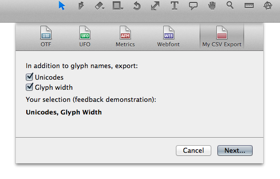

Welcome to Glyphs.app’s plug-in documentation. 

This documentation here covers only a few details of the whole process. If you’re new to the subject, we recommend to start by [reading our tutorial](https://glyphsapp.com/tutorials/plugins), where you will later be asked to return here.

## File Format Plug-in

At the moment, this plug-in provides font export functionality through the Export dialog.
Planned for the future are Save and Open functionalities.

This sample plug-in is functional and exports glyph names, unicodes and glyph width into a simple CSV file.
It makes use of a GUI through Interface Builder. See the description one level up (https://github.com/schriftgestalt/GlyphsSDK/tree/master/Python%20Templates) on how to use it.



# User code

A functional plug-in can be as small as this (in `Contents/Resources/plugin.py`):

```python
# encoding: utf-8

from GlyphsPlugins import *

class ____PluginClassName____(FileFormatPlugin):
	
	dialog = objc.IBOutlet()

	def settings(self):
		self.name = 'My CSV Export'
		self.icon = 'ExportIcon'

	def export(self, font):

		# Code that writes a file goes here...

		# Return values
		return (True, 'The export of the file was successful.')
```

The methods in detail:

#### settings()

In this method you set all attributes that describe the plug-in, such as its name and icon etc.


```python
	def settings(self):

		# The name as it will appear in the Export dialog
		# You may use a simple string or Glyphs.localize() for localizations (see http://docu.glyphsapp.com#localize)
		self.name = 'My CSV Export'
		# or:
		self.name = Glyphs.localize({'en': 'My CSV Export', 'de': 'Mein CSV-Export'})

		# The file name of the Interface Builder .nib file (the dialog) without file extension
		self.dialog = 'IBDialog'

		# The file name of the icon file without file extension
		self.icon = 'ExportIcon'

		# The position of the icon in the Export dialog toolbar
		self.toolbarPosition = 100
```

#### start()

This method gets called when the plug-in gets initialized upon Glyphs.app start.
You put all your initialization code here.

```python
	def start(self):

		# Your init code goes here...
```

#### export()

Use this method to write the file after the 'Next' button has been clicked in the Export dialog.

The `font` argument in the method will contain the `GSFont` object we’re dealing with.

Return value:
This function must return a tuple containing:
- `True`/`False` (Boolean describing the success of the file writing)
- Message (A text message describing the success/failure of the file writing)

```python
	def export(self, font):

		# Your file writing code goes here

		if exportSuccessful == True:
			return (True, 'The export was successful.')
		
		else:
			return (False, 'The export failed.')
```


# Other useful methods

#### GetSaveFile()

Dialog to choose export destination. It is found in the Python API, documented here: http://docu.glyphsapp.com/#GetSaveFile

Optional arguments:
- `title` (a string for the title of the file dialog)
- `proposedFilename` (a string describing a possible file name)
- `fileTypes` (a list (not a tuple!) of acceptable file name extensions)

```python
	def export(self, font):
	
		# Ask for export destination and write the file:
		title = "Choose export destination"
		proposedFilename = font.familyName
		fileTypes = ['csv']

		# Call dialog
		filepath = GetOpenFile(title, proposedFilename, fileTypes)
		
		# Your file writing code goes here...
```
