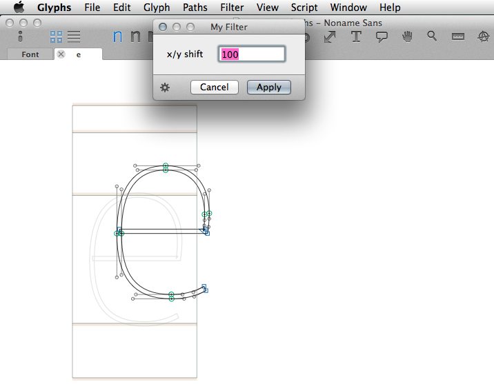
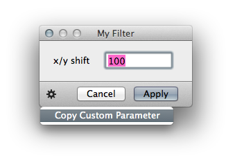

The filter plugin (with dialog) gets called either from the Filter menu, or through Custom Parameters upon font export.



This is how you call the filter through Custom Parameters:
In the font’s Info dialog, for each *instance* add a `Custom Parameter` called `Filter`. 

The value should contain a semicolon-separated list of the following:
- The plugin name (by its Python class name, so `____PluginClassName____` in the virgin plugin)
- `include`: A list of glyphs to exercise the filter on. Only these glyphs will be used.
- `exclude`: A list of glyphs to exclude from the filter. All glyphs of the font except those will be used.
- Any other custom parameter of your choice in the `key:value` format.

If neither of the two `include`/`exclude` statements are provided, the Filter will be applied to all glyphs in the font.


# User code

A functional plugin can be as small as this (in `Contents/Resources/____PluginFileName____.py`):

```python
# encoding: utf-8

from GlyphsPlugins import *

class ____PluginClassName____(FilterWithDialog):

	# Definitions of IBOutlets
	
	# The NSView object from the User Interface. Keep this here!
	dialog = objc.IBOutlet()

	# Text field in dialog
	myTextField = objc.IBOutlet()
	
	def settings(self):
		self.menuName = 'My Filter'

	# On UI trigger
	def start(self):

		# Set default setting if not present
		if not Glyphs.defaults['com.myname.myfilter.value']:
			Glyphs.defaults['com.myname.myfilter.value'] = 15.0

		# Set value of text field
		self.myTextField.setFloatValue_(Glyphs.defaults['com.myname.myfilter.value'])
		
		# Set focus to text field
		self.myTextField.becomeFirstResponder()

	# Action triggered by UI
	@objc.IBAction
	def setValue_( self, sender ):

		# Store value coming in from dialog
		Glyphs.defaults['com.myname.myfilter.value'] = sender.floatValue()

		# Trigger redraw of preview
		self.preview()

	# Actual filter
	def filter(self, layer, inEditView, customParameters):
		
		# Called on font export, get value from customParameters
		if customParameters.has_key('shift'):
			value = customParameters['shift']

		# Called through UI, use stored value
		else:
			value = Glyphs.defaults['com.myname.myfilter.value']

		# Shift all nodes in x and y direction by the value
		for path in layer.paths:
			for node in path.nodes:
				node.position = NSPoint(node.position.x + value, node.position.y + value)
```


From there you can add the following methods:

#### settings()

In this method you set all attributes that describe the plugin, such as its name etc.


```python
	def settings(self):

		# The name as it will appear in Glyphs’s Filter menu
		# You may use a simple string or Glyphs.localize() for localizations (see http://docu.glyphsapp.com#localize)
		self.menuName = 'My Filter'
		# or:
		self.menuName = Glyphs.localize({'en': 'My Filter', 'de': 'Mein Filter'})

		# A keyboard shortcut for adctivating/deactivating the plugin (together with Command+Shift)
		self.keyboardShortcut = 'p'

		# The name of the Interface Builder file containing the UI dialog, without file extension
		self.dialogName = '____PluginFileName____Dialog'

		# The caption of the action button of the dialog. 'Apply' is the default.
		self.actionButtonLabel = 'Apply'

```

#### start()

This method gets called when the plugin gets initialized upon filter menu click (and the dialog gets displayed).
You put all your initialization code here.

```python
	def start(self):

		# Your init code goes here...
```

#### filter()

This is the main method that should contain your code to be executed on the glyphs. The actual filter.

- The argument `layer` will contain a `GSLayer` object to deal with.
- The argument `inEditView` is a boolean (`True`/`False`) and describes whether or not the user has called the filter through the filter menu while editing a single glyph in the Edit View.
- The argument `customParameters` contains a dictionary of values that came through the `Custom Parameters` field upon font export (other than the filter name and include/exclude statements). If these values were not defined in `key:value` format, but only `value` without a value name, the dictionary will contain integers starting with `0` as keys. You may use `len(customParameters)` to get hold of these keys for looping.

So there are three scenarios to consider:

##### 1. Call through Filter menu in Edit View

The user is editing a glyph in the Edit View and has clicked on the filter in the Filter menu.
`inEditView` will be set to `True` and `customParameters` will be empty and the `filter()` method will be called only once.

In this scenario, you could pay attention to what objects the user has selected in the Edit View using either `GSLayer.selection` (all objects such as paths, components, anchors) or the selectable object’s individual `.selected` attribute.

##### 2. Call through Filter menu in Font View

The user has selected several glyphs in the Font View and has clicked on the filter in the Filter menu.
`inEditView` will be set to `False` and `customParameters` will be empty and the `filter()` method will be called several times, each time containing a different `layer`.

##### 3. Call through Custom Parameters upon font export

The user is exporting a font whose instances contain Custom Parameters that call the plugin.
`inEditView` will be set to `False` and `customParameters` will contain any custom parameter (other than the plugin name, include and exclude statements) that the user has specified in the parameters. You will need to educate the users of your plugin about what these parameters should look like. The `filter()` method will be called several times according to the results of the include/exclude statements, each time containing a different `layer`.

```python
	def filter(self, layer, inEditView, customParameters):
		
		# Apply your filter code here
```

#### customParameterString()

If this method is implemented, the filter dialog will show a small gear icon in the lower left corner of the dialog. Upon click a menu will appear that will let you copy a string (returned by this method) to the clipboard describing the plugin and the currently chosen values (in the dialog). These are the values needed to define Custom Parameters for the font’s instances to apply the filter on font export. You may paste this string directly into the Custom Parameters field as descibed below:

Copy Custom Parameters:



Paste into Custom Parameters field:


```python
	def customParameterString( self ):

		# Copy plugin name (by its class name) with a 'shift' value
		return "%s; shift:%s;" % (self.__class__.__name__, Glyphs.defaults['com.myname.myfilter.value'] )
```

# Other useful methods

#### preview()

This method will display the original glyph as a background image and apply your custom `filter()` method.

This already happens directly after you activate the filter through the menu, and you should call the `preview()` method each time the user changes the value in the dialog. Therefore, it makes sense to place it in whichever method receives the actions from the dialog (which is `setValue_()` in the example).

```python
	# Action triggered by UI
	@objc.IBAction
	def setValue_( self, sender ):
		
		# Store value coming in from dialog
		Glyphs.defaults['com.myname.myfilter.value'] = sender.floatValue()

		# Trigger redraw of preview
		self.preview()
```
