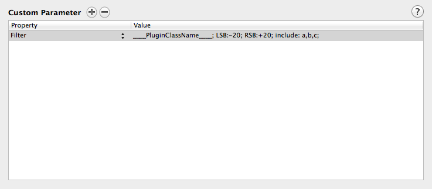

The filter plugin (without dialog) gets called either from the Filter menu, or through Custom Parameters upon font export.


This is how you call the filter through Custom Parameters:
In the font’s Info dialog, for each instance add a `Custom Parameter` called `Filter`. 

The value should contain a semicolon-separated list of the following:
- The plugin name (by its Python class name, so `____PluginClassName____` in the virgin plugin)
- `include`: A list of glyphs to exercise the filter on. Only these glyphs will be used.
- `exclude`: A list of glyphs to exclude from the filter. All glyphs of the font except those will be used.
- Any other custom parameter of your choice in the `key:value` format.




# User code

A functional plugin can be as small as this (in `Contents/Resources/____PluginFileName____.py`):

```python
# encoding: utf-8

from plugin import *
from AppKit import *

class ____PluginClassName____(FilterWithoutDialog):
	
	def settings(self):
		self.menuName = 'My Filter'

	def filter(self, layer, inEditView, customParameters):
		
		# Apply your filter code here
```


From there you can add the following methods:

#### settings()

In this method you set all attributes that describe the plugin, such as its name and icon etc.


```python
	def settings(self):

		# The name as it will appear in Glyphs’s Filter menu
		self.menuName = 'My Plugin'

		# A keyboard shortcut for adctivating/deactivating the plugin (together with Command+Shift)
		self.keyboardShortcut = 'p'
```

#### loadPlugin()

This method gets called when the plugin gets initialized upon Glyphs.app start.
You put all your initialization code here.

```python
	def loadPlugin(self):

		# Your init code goes here...
```

#### filter()

This is the main method that should contain your code to be executed on the glyphs. The actual filter.

The argument `layer` will contain a `GSLayer` object to deal with.
The argument `inEditView` is a boolean (`True`/`False`) and describes whether or not the user has called the filter through the filter menu while editing a single glyph in the Edit View.
The argument `customParameters` contains a dictionary of values that came through the `Custom Parameters` field upon font export.

So there are three scenarios to consider:

##### 1. Call through Filter menu in Edit View

The user is editing a glyph in the Edit View and has clicked on the filter in the Filter menu.
`inEditView` will be set to `True` and `customParameters` will be empty and the `filter()` method will be called only once.

##### 2. Call through Filter menu in Font View

The user has selected several glyphs in the Font View and has clicked on the filter in the Filter menu.
`inEditView` will be set to `False` and `customParameters` will be empty and the `filter()` method will be called several times, each time containing a different `layer`.

##### 3. Call through Custom Parameters upon font export

The user is exporting a font whose instances contain Custom Parameters that call the plugin.
`inEditView` will be set to `False` and `customParameters` will contain any custom parameter (other than the plugin name, include and exclude statements) that the user has specified in the parameters. You will need to educate the users of your plugin about what these parameters should look like. The `filter()` method will be called several times according to the results of the include/exclude statements, each time containing a different `layer`.

```python
	def filter(self, layer, inEditView, customParameters):
		
		# Apply your filter code here
```