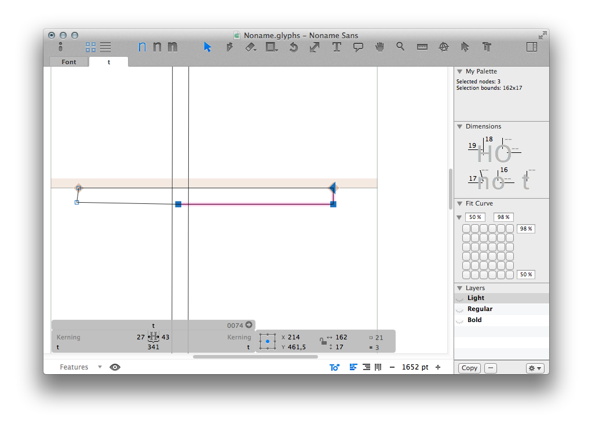

Welcome to Glyphs.app’s plug-in documentation! This document covers only some details of the process. If you are new to the subject, we recommend you start with [reading our tutorial](https://glyphsapp.com/tutorials/plugins), which points you back here at the appropriate moment.

## Palette Plug-in

The palette plug-in will show up as a dialog in Glyphs.app’s sidebar on the right edge of the application window. 

You may use it to display information about the glyphs or add controls to change them.
For displaying information, you would typically use callbacks that tie in with events being fired in Glyphs.app, such as the `GSUpdateInterface` event, which gets fired each time anything is being redrawn in the user interface. This can happen quite often, so be careful as to how complicated your code becomes.




# User code

A functional plug-in can be as small as this (in `Contents/Resources/plugin.py`):

```python
# encoding: utf-8

from GlyphsApp.plugins import *

class ____PluginClassName____ (PalettePlugin):

	# The Interface Builder dialog
	dialog = objc.IBOutlet()

	# A text field to display information in that dialog
	textField = objc.IBOutlet()
	
	def settings(self):
		self.name = 'My Palette'
		self.loadNib('IBdialog')
	
	def start(self):

		# Adding a callback for the 'GSUpdateInterface' event
		s = objc.selector( self.update, signature="v@:" )
		NSNotificationCenter.defaultCenter().addObserver_selector_name_object_( self, s, "GSUpdateInterface", None )

	def update( self, sender ):

		# Your code goes here...

	def quit(self):
		
		# Delete callbacks when Glyphs quits, otherwise it'll crash :( 
		NSNotificationCenter.defaultCenter().removeObserver_(self)
```

From there you can add the following methods:

#### settings()

In this method you set all attributes that describe the plug-in, such as its name etc.


```python
	def settings(self):

		# The name as it will appear in the sidebar
		# You may use a simple string or Glyphs.localize() for localizations (see http://docu.glyphsapp.com#localize)
		self.name = 'My Palette'
		# or:
		self.name = Glyphs.localize({'en': u'My Palette', 'de': u'Mein Palette'})

		# Load .nib dialog (without .extension)
		self.loadNib('IBdialog')
```

#### start()

This method gets called when the plug-in gets initialized upon Glyphs.app start.
You put all your initialization code here.
In our example, this would be adding the callbacks.

An observer needs a method to execute. In our example, we’ve used a method named `update()`, but you can name your methods otherwise.

```python
	def start(self):

		# Adding a callback for the 'GSUpdateInterface' event
		s = objc.selector( self.update, signature="v@:" )
		NSNotificationCenter.defaultCenter().addObserver_selector_name_object_( self, s, "GSUpdateInterface", None )
```

#### update()

In our example, this method gets called through the callbacks you may have added upon `start()`.

We’ve named this method `update()`, but you can name your methods otherwise.

```python
	def update(self):

		# Your code goes here...
```

#### quit()

This method gets called when Glyphs.app is being quitted.
You need to unload all callbacks here because Glyphs.app will otherwise crash.

```python
	def quit(self):

		# Unload callback
		NSNotificationCenter.defaultCenter().removeObserver_(self)
```

# Use Vanilla for the dialog view

The sample code uses Interface Builder for the dialog, but you may use [Vanilla](https://github.com/typesupply/vanilla) instead. Here is how:

As opposed to Interface Builder, dialogs get created entirely in code only using Vanilla, which might be advantageous for you if Xcode looks too daunting.

We need to create a so called [Group](http://ts-vanilla.readthedocs.org/en/latest/objects/Group.html) that contains a set of objects. Of this group, we can get hold of the wrapped `NSView` object to display in Glyphs. Note that due to Vanilla internals, we have to create a window first, although that window isn’t getting any attention anymore later on, and it must contain a `Group()` of the same size. Note that stretching the `Group` to the far corners of the windows using `(0, 0, -0, -0)` may not work, so explicitly define its size identical to the containing window.

Make sure that the .dialog gets defined in the `settings()` class, not at the class root.
Also, you may delete the two `IBdialog.xib/.nib` files from the `Resources` folder of the plug-in.


```python
# encoding: utf-8

from GlyphsApp.plugins import *
from vanilla import *

class ____PluginClassName____(SelectTool):

	def settings(self):
		self.name = 'My Select Tool'

		# Create Vanilla window and group with controls
		width = 150
		height = 80
		self.paletteView = Window((width, height))
		self.paletteView.group = Group((0, 0, width, height))
		self.paletteView.group.text = TextBox((10, 0, -10, -10), self.name, sizeStyle='small')

		# Set dialog to NSView
		self.dialog = self.paletteView.group.getNSView()

	def update(self, sender):

		# ...
		# other code from example update() method goes here
		# ...
		
		# Change value of text field using Vanilla like this:
		self.paletteView.group.text.set('\n'.join(text))

```
