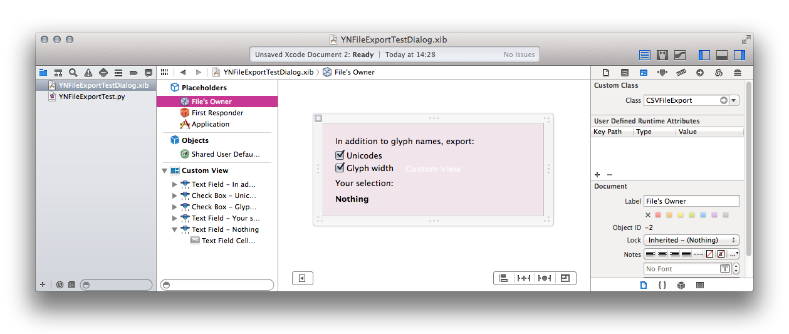
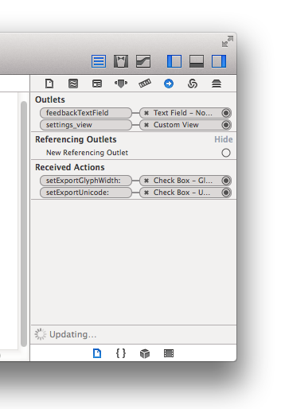

Welcome to Glyphs.app’s plug-in documentation! This document covers only some details of the process. If you are new to the subject, we recommend you start with [reading our tutorial](https://glyphsapp.com/tutorials/plugins), which points you back here at the appropriate moment.

## Using the Python Templates

Copy the skeleton plug-in into Glyphs’ plug-in folder located at `~/Library/Application Support/Glyphs/Plugins` (`~` stands for your user account’s home folder).

We need to rename a few things in the contained files, so open the package in your contemporary text editor. It should display the internal folder structure of the plug-in in a side-bar for easy access. 

## Edit the Files

Replace all placeholders that have quadruple underscores (like `____placeholder____`) in these files:

* `Contents/Info.plist`
* `Contents/Resources/plugin.py`
* `Contents/Resources/IBdialog.xib` (Only in case that plug-in actually uses a dialog. Don’t forget to re-compile. See the *Interface Builder* section below.)

### Edit `Contents/Info.plist`:

These variables will need to be replaced by you:

#### Name of plug-in

For the plug-in name, we are dealing with two different name variations:

* `____PluginName____` is a human readable name that will show up in places such as the *Plugins* tab of Glyphs’ preferences window. This name may contain spaces and Unicode characters.
* `____PluginClassName____` is the machine readable name of the Python class in your code and needs to be put into a few places. It needs to be unique, as in: You can’t install two plug-ins next to each other that have the same class name. Although I wrote "machine readable", there is one interaction where the user of the plug-in will get to see this class name: Calling Filters through Custom Parameters upon file export. So make it a friendly and unique name. Only ASCII characters and no spaces allowed here. We recommend `camelCaseNames`.

#### Other meta data

* `____Developer____` is your name
* `____Year____` is the release year of your plug-in

#### Plug-in version and update mechanism

Glyphs provides automatic update checks and notifications (not automatic installation) for installed plug-ins and will notify users in the user interface when a new version is available. It will once per day (or upon click in the preferences) check a URL that must contain a xml file very similar (or even identical) to the shipped `Info.plist`. This online xml file must contain at least the two fields `CFBundleVersion` and `productPageURL`.

But even if you don’t want to participate in the automatic update notifications, it is advisable to fill in the version numbers.

> Pro tip: Think ahead and specify at least a URL for automatic update notifications even if it’s way too early for you to implement the update procedure. Glyphs can handle an error response for that URL until the time has come. Consider that once your plug-in has shipped to users, it’s too late to remedy.

> Simply take this `Info.plist` file, upload it on some server, and place a http link to that file into the `UpdateFeedURL` field of the shipped plug-in’s `Info.plist`. For the time being, leave the version number in `CFBundleVersion` in the online file the same as the shipped file. When the time has come, you’ll fill in the new version number and the `productPageURL` field, and voilà: we have established ourselves an automatic update notification process.

The variables in detail:

* `____BundleVersion____` is a machine-readable version identifier for the plug-in. It must contain either an integer (`15`) or a float (`1.6`) version number. Glyphs will also use this version number to compare the currently installed plug-in to the version number made available online.
* `____BundleVersionString____` is a human-readable description of the version number. It may contain characters other than numbers and the period, such as more periods or a alpha/beta identifier, like so: `1.6.1a`. it may of course also be identical to *`____BundleVersion____`*.
* `____OnlineUrlToThisPlist____` is where Glyphs will look online for newer versions of your plug-in. The result must be a `.plist` xml file similar to the shipped `Info.plist` and must contain at least the two fields *`CFBundleVersion`* and *`productPageURL`*.
* `____ProductPageURL____` is where Glyphs will take the user once he got notified of an existing update and has clicked on the notification. On this page, you should make your new plug-in version available for download, since Glyphs will not automatically install the update (at this point).
* `____LatestReleaseNotes____` is an optional description of the lastest plug-in version, e.g., *‘New feature X’*. This will be displayed when the user checks for updates in the app preferences, and will motivate your users to keep your plug-ins up to date.


###### Dynamic version information

If you operate your own software distribution system, like an online shop, you can have your server output this Info.plist with dynamic information about the latest version of the plugin, instead of keeping the online Info.plist manually up to date. Please make sure that the file is delivered in the `application/xml` MIME-type.

Glyphs will add the URL parameters `glyphsUniqueID` (an anonymous ID identifying unique Glyphs installations on people's computer's) and `glyphsVersion` (the Build number of that Glyphs installation) to the update check call (planned but not yet implemented: `pluginVersion` describing the version of your plug-in installed within the user's Glyphs installation). You can use this information to keep anonymous track of the number of plugin installations out there and their version information and level of adoption.

The interface language of Glyphs makes its way into the update check call via the HTTP headers. Therefore, you may choose to provide the `productReleaseNotes` dynamically in various languages.

A live example of all of this can be found for Yanone’s Speed Punk, with `productReleaseNotes` provided in English and German (if you click the following link here in your browser, your browser will send the preferred languages via the HTTP headers identical to how Glyphs would do it): https://yanone.de/buy/?page=versionInformation&product=speedpunkglyphs&format=GlyphsInfoPlist

### Edit `Contents/Resources/plugin.py`:

This is where your own code goes. You need to rename the main class `class ____PluginClassName____(...)` to the above mentioned class name.

### Edit `Contents/Resources/IBdialog.xib`:

Should your plug-in contain a dialog, you need to likewise rename the pointer `____PluginClassName____` to the principal class. This is quickest done in text editor, but you can (and must) also read through the Interface Builder instructions below and could change the value in Xcode/Interface Builder.

Don’t forget to re-compile. See the *Interface Builder* section below.


## Interface Builder: Adding GUI elements

The interaction between your Python script and a graphical user interface (GUI) requires the use of Interface Builder, which is part of Apple’s Xcode software development environment. The work with Interface Builder can be a bit daunting, but we’ve written a step-by-step walkthrough here for you that will get you going quickly. After your first completed GUI interaction, using it will become as natural as all the rest.

Your Python code communicates with the UI through:

- **IBOutlets** *(.py->GUI)*: Make UI elements available to your Python code. Then your code can change these elements (like the caption of a text field)
- **IBActions** *(GUI->.py)*: Call methods in the Python code from actions in the UI (like the click of a button)

The sample plug-ins here that use a UI, `File Format`, `Filter With Dialog`, and `Palette`, are small functional plug-ins that make use of both IBOutlets and IBActions.

##### 1. IBOutlets: Make UI elements available to Python 

At the root of the plug-in class, you define variables that will be linked to UI elements. In this example, we want to create a pointer to a text field in the dialog to the variable `textField `.

```python
class CSVFileExport (FileFormatPlugin):
    textField = objc.IBOutlet() # A text field in the user interface
```

##### 2. IBActions: Let UI elements trigger Python functions

Functions to be triggered from the UI get defined by a `@objc.IBAction` just before the function definition.
The function names need to end with an underscore, e.g. `setValue_()`.

```python
	@objc.IBAction
	def setExportUnicode_(self, sender):
		self.exportUnicode = sender.intValue()
		self.updateFeedBackTextField()
```

##### 3. Interface Builder



- Open the .xib file in Xcode, and add and arrange interface elements
- Add this .py file via *File > Add Files...* for Xcode to recognize all IBOutlets and IBActions
- In the left sidebar, choose *Placeholders > File's Owner*, in the right sidebar, open the *Identity inspector* (3rd icon), and put the name of this controller class in the *Custom Class > Class* field (the above used `____PluginClassName____` variable)
- The most important **IBOutlet** is the pointer to the the main window pane. It should be set to `dialog`, which is a predefined variable that we use. Should you still want to change it: Ctrl-drag from the *File's Owner* to the window pane (called *Custom View*) either in the graphical arrangement or in the list on the left, then choose `dialog` (or whatever) from the pop-up list, to establish the connection between the Python variable and the main NSView object


- Other **IBOutlets**: Ctrl-drag from the *File’s Owner* to a UI element (e.g. text field), and choose which outlet shall be linked to the UI element
- **IBActions**: Ctrl-drag from a UI element (e.g. button) to the *File’s Owner* in the left sidebar, and choose the function that the UI element is supposed to trigger
- **Only for File Format Plugin:** In the left-side objects side bar choose *Custom View*, and in the right-side pane choose *Attributes inspector* (4th icon), and deactivate *Translate Mask Into Constraints*. Don't ask, just do it.

All the back and forth relations between the UI and your Python code can be reviewed in the *Connection inspector* (6th icon on the right).




##### 4. Compile .xib to .nib

As a last step, you need to compile the `.xib` (the user-editable dialog) file to a `.nib` file with this *Terminal* command: `ibtool xxx.xib --compile xxx.nib`.
Please note: Every time the .xib is changed, it has to be **recompiled** to a .nib. 

For convenience, we provide a droplet app that will accept your `.xib` file so you don’t have to fiddle with the paths in the Terminal. Just drag the `.xib` file (maybe directly from inside your text editor) onto the icon that you may have conveniently placed in your Dock.


You’ll find the dropplet .app here in this *Python Templates* folder in the Git repository.

## Plug-in Manager

Make your plug-in available for easy installation via *Window > Plugin Manager* in app versions 2.3 and later. To do that, simply make a pull request for the `packages.plist` file in the [glyphs-packages](https://github.com/schriftgestalt/glyphs-packages) repository. All you need to add in that file are these few lines:

			{
				name = "PluginNameWithExtension.glyphsPlugin";
				url = "https://github.com/userName/repositoryName";
				description = "Single-line description. Careful: WITHOUT LINEBREAKS! Use \n instead.";
				screenshot = "https://optional.link.to/pluginScreenshot.png";
			}

Entries must be separated by commas. So don’t forget a comma right after the closing curly brace `}` if another entry is following. (And on the previous line if you add your entry at the end.) The order of entries does not matter, the manager will sort all registered plug-ins alphabetically anyway.

## Further reading

For a quick introduction to using Interface Builder with the PyObjC bridge, read http://blog.adamw523.com/os-x-cocoa-application-python-pyobjc/

For the complete reference for the UI elements, see Apple's AppKit Framework Reference: https://developer.apple.com/library/mac/documentation/Cocoa/Reference/ApplicationKit/ObjC_classic/index.html

## Troubleshooting and Debugging

Check *Console.app* for error messages to see if everything went right.
You can also output your own debug code to *Console.app* using the plugin’s own `self.logToConsole()` function.

> Tip: Enter 'Glyphs' into Console.app’s search field to filter for the relevant messages.
