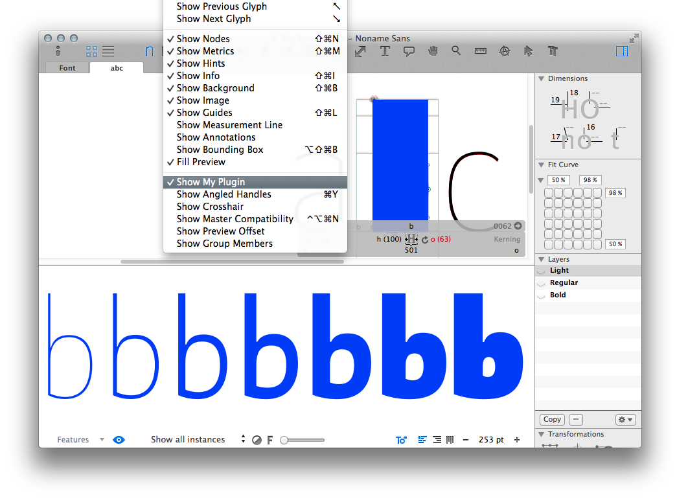

A reporter plugin get activated in the View menu of Glyphs.app and is designed to draw on top and behind the Edit View, as well as change the drawing behaviour of inactive glyphs and the preview panel.




## User code

A functional plugin can be as small as this (in `Contents/Resources/____PluginFileName____.py`):

```python
# encoding: utf-8

from plugins import *
from AppKit import *

class ____PluginClassName____(ReporterPlugin):
	def loadPlugin(self):

		# The name as it will appear in Glyphs’s View menu
		self.menuName = 'My Plugin'

	def drawForeground(self, layer):

		# Draw a blue rectangle on top of the glyph as big as the glyph’s bounding box
		NSColor.blueColor().set()
		NSBezierPath.fillRect_(layer.bounds)
```


From there you can add the following methods:

#### loadPlugin()

This method gets called when the plugin gets initialized upon Glyphs.app start.
You put all your initialization code here, including attributes that describe the plugin, such as its menu name.

```python
	def loadPlugin(self):

		# The name as it will appear in Glyphs’s View menu
		self.menuName = 'My Plugin'

		# A keyboard shortcut for adctivating/deactivating the plugin
		self.keyboardShortcut = 'p'

		# Modifier keys used for the keyboard shortcut
		# Set to any combination of:
		# NSShiftKeyMask | NSControlKeyMask | NSCommandKeyMask | NSAlternateKeyMask
		self.keyboardShortcutModifier = NSCommandKeyMask | NSShiftKeyMask
```

#### drawForeground()

Use this method to draw things on top the glyph outlines in the edit view.

```python
	def drawForeground(self, layer):

		# Draw a blue rectangle on top of the glyph as big as the glyph’s bounding box
		NSColor.blueColor().set()
		NSBezierPath.fillRect_(layer.bounds)
```

#### drawBackground()

Use this method to draw things behind the glyph outlines in the edit view.

```python
	def drawBackground(self, layer):

		# Draw a red rectangle on behind the glyph as big as the glyph’s bounding box
		NSColor.redColor().set()
		NSBezierPath.fillRect_(layer.bounds)
```

#### drawBackgroundForInactiveLayers()

Use this method to replace Glyph.app’s default drawing method for drawing inactive glyphs (the glyphs left and right of the active glyph in the edit view) as well as the glyphs in the edit view.

If you want to draw the glyphs in the edit view even different that the inactive glyphs, also implement the `drawPreview()` method as described below.

```python
	def drawBackgroundForInactiveLayers(self, layer):

		# Draw outlines in blue
		if layer.paths:
			NSColor.blueColor().set()
			layer.bezierPath().fill()

		# Draw components in red
		if layer.components:
			NSColor.redColor().set()
			for component in layer.components:
				component.bezierPath().fill()
```

#### drawPreview()

Use this method to replace Glyph.app’s default drawing method for glyphs in the preview panel.

You must implement `drawBackgroundForInactiveLayers()` first and implement `drawPreview()` only as a deviation from `drawBackgroundForInactiveLayers()`.

`drawPreview()` cannot be implemented standalone without `drawBackgroundForInactiveLayers()`.

```python
	def drawPreview(self, layer):

		# Draw outlines in blue
		if layer.paths:
			NSColor.blueColor().set()
			layer.bezierPath().fill()

		# Draw components in red
		if layer.components:
			NSColor.redColor().set()
			for component in layer.components:
				component.bezierPath().fill()
```

## Other useful methods

#### drawTextAtPoint()

Draw a string of text at a given position.

Mandatory arguments:
- `text` (A string of text)
- `position` (`NSPoint` object of position)

Optional arguments:
- `fontSize` (Size of text in points. Default: 10)
- `align` (Alignment of text. Default: `bottomleft`. Choose from: `topleft`, `topcenter`, `topright`, `left`, `center`, `right`, `bottomleft`, `bottomcenter`, `bottomright`)
- `fontColor` (`NSColor` object. Default: black)

```python
	def drawForeground(self, layer):
		
		# Draw name of glyph at 0,0
		self.drawTextAtPoint(layer.parent.name, NSPoint(0, 0))

```

## Debugging/errors

Due to the structure of Glyphs, external plugins can’t print to the normal Macro window output. Instead, tracebacks will get printed to Mac’s Console.app.

You can also use `logToConsole()`as described below to print your own debugging messages to Console.app.

Useful: When you open Console.app, filter for message coming from Glyphs.app by typing `glyphs` into its seach field.


#### logToConsole()


Mandatory arguments:
- `message` (A string of text)

```python
	def drawForeground(self, layer):
		
		# Write glyphs’s name to the Console
		self.logToConsole(layer.parent.name)

```

