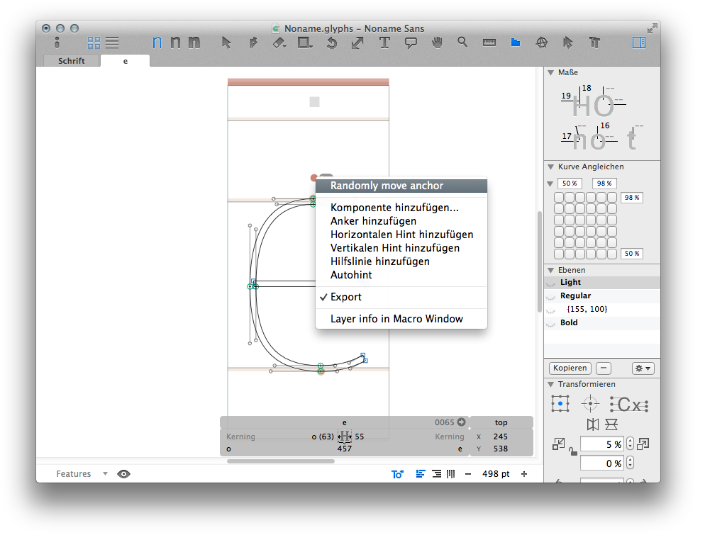

Welcome to Glyphs.app’s plug-in documentation. 

This documentation here covers only a few details of the whole process. If you are new to the subject, we recommend to start by [reading our tutorial](https://glyphsapp.com/tutorials/plugins), where you will later be asked to return here.

## Select Tool

The Select Tool Plugin creates a replacement for the standard select tool and lets you extend its functionality.

You can add context menus (that appear on the user’s mouse right-click), both general context menus (they always appear) as well as conditional context menus (they only appear under a certain condition defined in your code).

In its naked version, the plug-in behaves exactly like the built-in select tool.



# User code

A functional plug-in can be as small as this (in `Contents/Resources/plugin.py`):

```python
# encoding: utf-8

from GlyphsPlugins import *

class ____PluginClassName____(SelectTool):
	
	def settings(self):
		self.name = 'My Select Tool'
		self.contextMenus = [
			{"name": "Layer info in Macro Window", "action": self.printInfo},
		]

	def printInfo(self):
		"""
		Example for a method triggered by a context menu item.
		Fill in your own method name and code.
		Remove this method if you do not want any extra context menu items.
		"""

		# Execute only if layers are actually selected
		if Glyphs.font.selectedLayers:
			layer = Glyphs.font.selectedLayers[0]
		
			# Do stuff:
			print "Current layer:", layer.parent.name, layer.name
			print "  Number of paths:", len(layer.paths)
			print "  Number of components:", len(layer.components)
			print "  Number of anchors:", len(layer.anchors)
```


From there you can add the following methods:

#### settings()

In this method you set all attributes that describe the plug-in, such as its name and icon etc.


```python
	def settings(self):

		# The name as it will appear in Glyphs’s toolbar as a tooltip
		# You may use a simple string or Glyphs.localize() for localizations (see http://docu.glyphsapp.com#localize)
		self.name = 'My Select Tool'
		# or:
		self.name = Glyphs.localize({'en': 'My Select Tool', 'de': 'Mein Auswahlwerkzeug'})

		# A keyboard shortcut for adctivating/deactivating the plug-in
		self.keyboardShortcut = 'p'

		# Position of the tool icon in the toolbar
		self.toolbarPosition = 100

		# A list of general context menu items described as a dictionary of following keys:
		# 'name': the text displayed in the menu
		# 'action': the method to call
		self.generalContextMenus = [
			{"name": "Layer info in Macro Window", "action": self.printInfo},
		]
```

#### start()

This method gets called when the plug-in gets initialized upon Glyphs.app start.
You put all your initialization code here.

```python
	def start(self):

		# Your init code goes here...
```

#### activate()

This method gets called when the tool gets activated through the toolbar.

```python
	def activate(self):

		# Your init code goes here...
```

#### deactivate()

This method gets called when the tool gets deactivated through the toolbar (another tool gets activated).

```python
	def deactivate(self):

		# Your code goes here...
```

#### foreground()

Use this method to draw things on top the glyph outlines in the Edit View.

```python
	def foreground(self, layer):

		# Draw a blue rectangle on top of the glyph as big as the glyph’s bounding box
		NSColor.blueColor().set()
		NSBezierPath.fillRect_(layer.bounds)
```

#### background()

Use this method to draw things behind the glyph outlines in the Edit View.

```python
	def background(self, layer):

		# Draw a red rectangle behind the glyph as big as the glyph’s bounding box
		NSColor.redColor().set()
		NSBezierPath.fillRect_(layer.bounds)
```

#### conditionalContextMenus()

Use this method to create and return a list of conditional context menu items.
These context menu items could be based on the user’s selection of objects in the Edit View and will appear first in the menu.

Return a list of context menu items described as a dictionary (see `self.generalContextMenus` in `settings()` above)

```python
	def conditionalContextMenus(self):

		# Empty list of context menu items
		contextMenus = []

		# Execute only if layers are actually selected
		if Glyphs.font.selectedLayers:
			layer = Glyphs.font.selectedLayers[0]
			
			# Exactly one object is selected and it’s an anchor
			if len(layer.selection) == 1 and type(layer.selection[0]) == GSAnchor:
					
				# Add context menu item
				contextMenus.append({"name": "Randomly move anchor", "action": self.randomlyMoveAnchor})

		# Return list of context menu items
		return contextMenus
```
